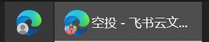

# 空投注意事项

## 推特账号防封

> 为防止被封，新推特账号使用注意事项:

- 新购买的白号
  1. ❗登入Twitter后最好绑定自己的手机，这样出现验证的情况更容易通过,未换绑不要关注和点赞,关注点赞容易出验证 
  2. ❗登入后不要立刻修改昵称修改头像,简介,用户名,密码和其他资料，如需修改等稳定后再修改，一般3~7天就稳定了。修改资料容易造成冻结,修改资料或设置不要一次性修改,每隔1天改一项

  3. 一个IP一个设备不要登录多个账号,登录多了容易出验证和冻结.

  4. 登入Twitter后不要急着加关注、转发、点赞、喜欢，先挂2~3天账号，3天后可以发推文,不发推文也可以，开始每天不要发太多，一般一天不要超过2篇，7天以后就可以正常操作，但也要注意量，大量操作也容易封号

  5. 要使用干净的IP线路，封过账号的线路最好不要用，太多人共用的线路最好不要用,不要经常换线路(IP)，最好能固定使用一条

  6. 不要经常登入登出账号，账号登入后不需要退出，不要经常换登入设备

  7. 不要短时间内大量关注，点赞，转发，喜欢等

  8. 不要发布广告或敏感内容

  9. 不要关注点赞评论可能被水军举报的帖子或者用户

  10. 浏览器登录请先清除cookie，APP登录请先卸载重装
- 新注册的账号
  1. 不如购买的账号那么严格，但是有关敏感内容需要注意
  2. 最好记住自己的账号id和名字和绑定的电话，出验证了可以通过

## 其他

1. 账号防封参考上面

2. 小白钱包推荐用okx钱包，因为okx钱包有插件，支持metamask钱包的都支持okx钱包，并且支持的网络很多

3. 推特账号如何登录

   因为推特一个浏览器只能最多登录5个账号而且我们买的推特账号不能频繁退出登录，所以我们采取以下两种方式

   - 账户多开

     我们用`edge`和`chorem`浏览器并采取**多个浏览器账号登录的形式**

     类似这样↓就是两个账号是独立的浏览器

     

   - 或者使用指纹浏览器 教程参考：https://x.com/cryptolfggo/status/1790951089745129774

4. 撸空投的时候如果涉及邀请链接 一定最好一个账号被邀请了就确认一次邀请的主账号的积分有没有到账 防止浪费账号邀请
5. 每个账号的名字和id要记住 否则冻结认证没法恢复

5. 最好撸空投的时候列一个Excel的表格方便记录 记录推特账号对应的钱包账户地址以及对应的空投网站
6. 在主号也就是你自己经常使用的账号里最好不用登录撸毛的账号 防止连带被封
7. 推特有时候会冻结或者验证账户 只要不是被封 能验证恢复的就不要慌
8. 自己的主号尽量不要做有社交任务的空投任务 因为转发点赞都是公开可见的，会污染你的推 