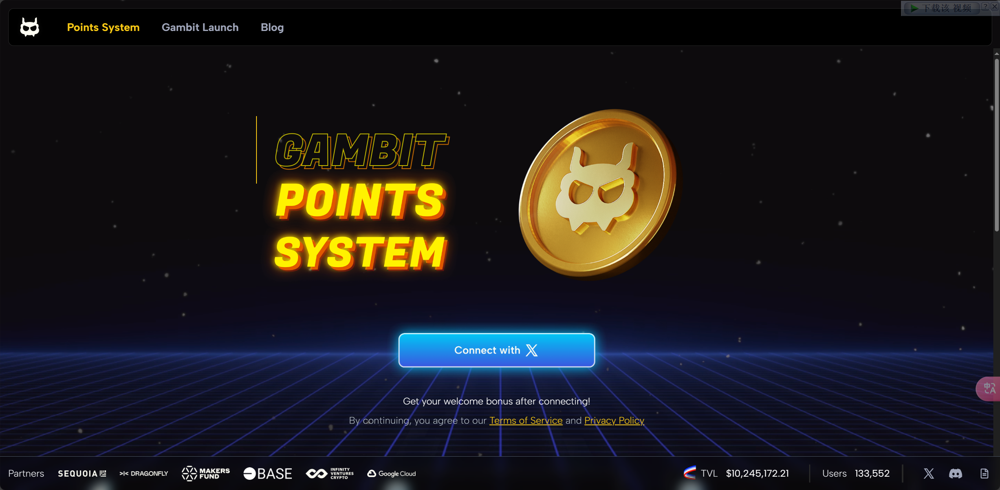
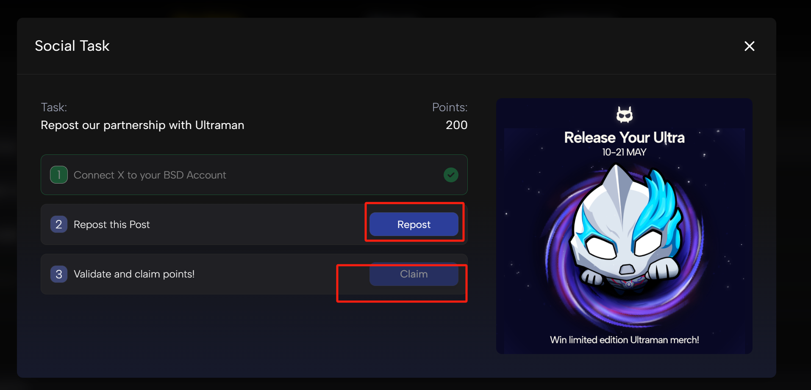

# Battle Showdown

自己没事整理一下空投资讯，主要是零撸的，供撸毛小白们使用，持续保持更新，也可提pr。

推特：[@RuoMinggX](https://x.com/RuoMinggX)

电报：[@RuoMinggX](https://t.me/RuoMinggX)

所有教程开源在 github: [web3 airdrop tutorial (github.com)](https://github.com/Patrickming/Airdrop-Tutorial/tree/main)

---

## 难度:简单 :star:

## 💲**邀请码**：wvh9so

1. 推特登录

2. 完成社交任务

- 零撸就只有做社交任务 这个任务更新的不是很频繁

- 做完任务然后验证