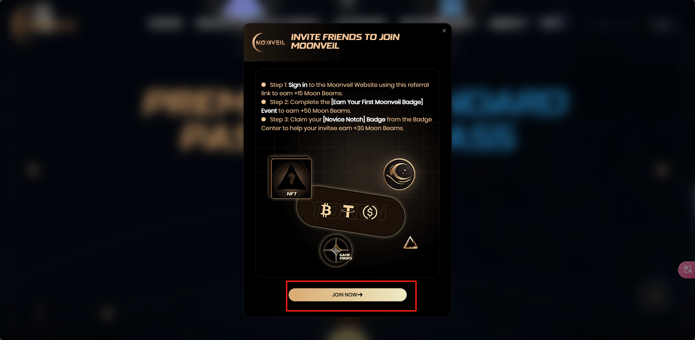
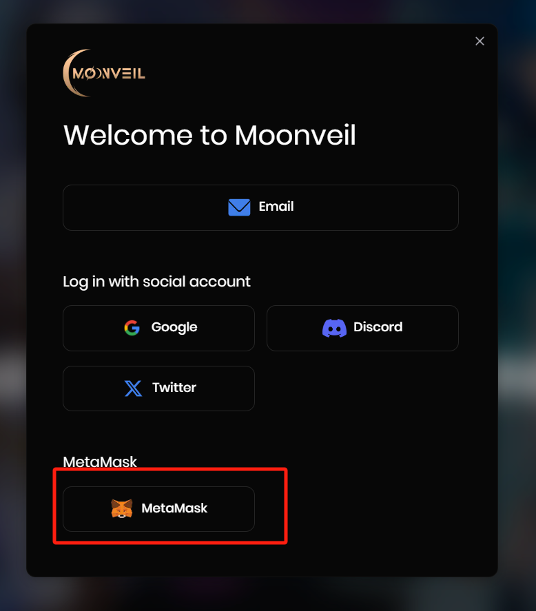

# MOONVEIL

自己没事整理一下空投资讯，主要是零撸的，供撸毛小白们使用，持续保持更新，也可提pr。

推特：[@RuoMinggX](https://x.com/RuoMinggX)

电报：[@RuoMinggX](https://t.me/RuoMinggX)

所有教程开源在 github: [web3 airdrop tutorial (github.com)](https://github.com/Patrickming/Airdrop-Tutorial/tree/main)

---

## 难度:简单 :star::star:

## 💲邀请链接：https://www.moonveil.gg?invite_code=TCEPPBEZ

1. 登录
- 加入moonveil

- 钱包登录

- 右上角进入个人中心页面

- 进入任务页面

- 任务面板

2. 第一部分 社交任务

- 游戏预注册

- 这里面可以验证自己的steam 游戏越多获得的积分越多 记得设置自己的steam账户为公开可见
- 社交任务：Twitter关注 加入dicord （这个时候就要验证自己的Twitter和dc）

3. 第二部分 还是社交任务
- 还是在推特上关注转发点赞
- 这部分的社交任务是会更新的 所以及时做❗❗

4. 第三部分任务 邀请任务
- 这部分邀请的人不是简单点击你的邀请链接就可以了，而是需要被邀请人完成`event`的第一个任务（下面介绍），获得徽章
- 具体查看要求：被邀请人完成到了什么程度可以verify相应的积分

5. 第四部分任务 event
- 各式活动，有的需要discord账号和推特账号
- 只有第一个活动是永驻的，必完成 是新手徽章 有这个徽章才能完成邀请任务 需要discord账号。其他活动时间到了就没了
- 这里面的活动无非就是两种
  - 推特关注、喜欢、转发、评论、根据模板发帖
  - discord内获取身份

- 第一种就是推特关注、喜欢、转发、评论、根据模板发帖

- 第二个是在discord完成任务 包括在下面这个公告下作出 `反应` 并 获得`频道身份`
  
  
  
  
  
  - 在频道里查看自己的身份
  
    

6. 通行证部分
- 完成的任务越多，获得的通行证积分越多，通行证也会升级 然后领取奖励
- ~~当然这里可以购买高级通行证获得更多奖励~~ 非零撸

