# MOONVEIL

自己没事整理一下空投资讯，主要是零撸的，供撸毛小白们使用，持续保持更新，也可提pr。

推特：[@RuoMinggX](https://x.com/RuoMinggX)

电报：[@RuoMinggX](https://t.me/RuoMinggX)

所有教程开源在 github: [web3 airdrop tutorial (github.com)](https://github.com/Patrickming/Airdrop-Tutorial/tree/main)

---

邀请链接：https://www.moonveil.gg?invite_code=TCEPPBEZ

登录（这个可以用推特或者钱包登录 建议先钱包登录）

进入个人中心页面

进入任务页面

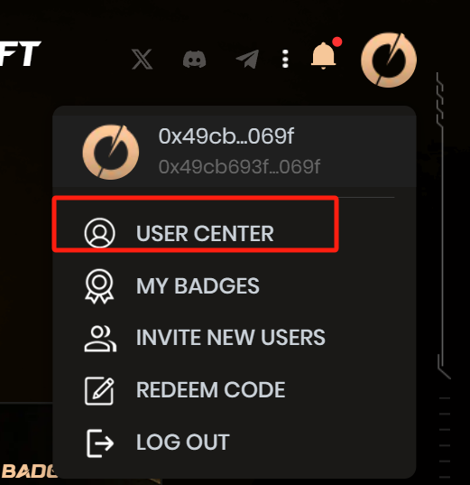

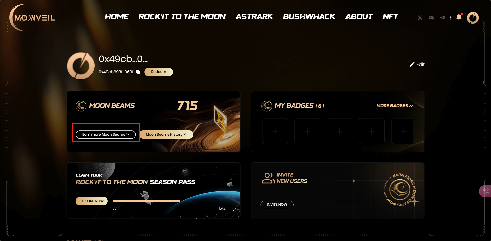

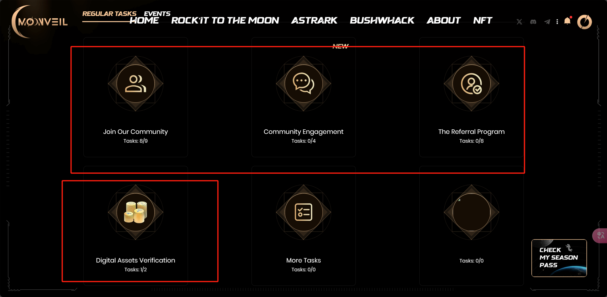

第一部分

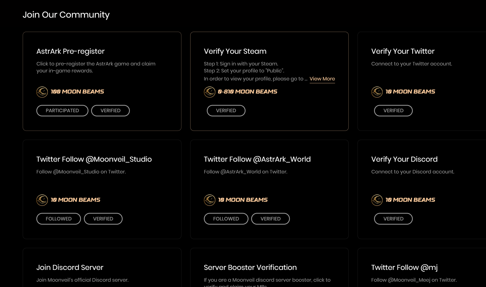

- 这里有一个预注册游戏和连接steam账号（根据游戏数来加积分）获得的积分比较多

第二部分

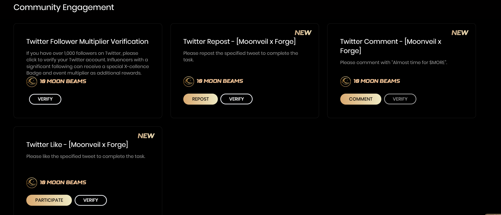

- 会有更新 更新后 以前的社交任务会消失

第三部分

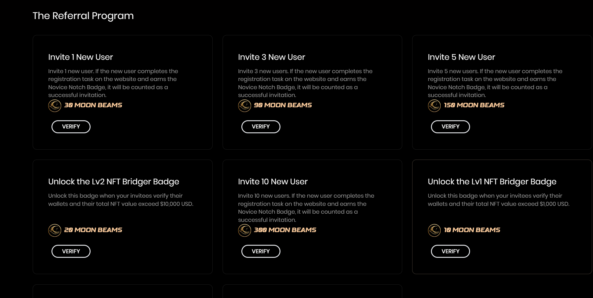

- 第三部分是邀请好友以及邀请的好友完成到了什么程度可以verify
  - 程度就是拿到第一个活动的徽章 也就是需要Twitter、dc账户缺一不可

event部分

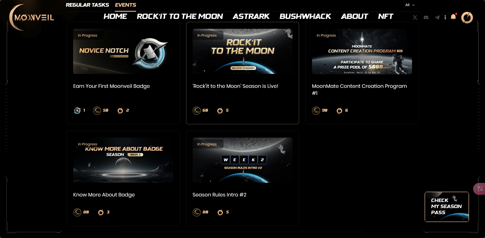

- 第一个必完成 是新手徽章 有这个徽章才能完成邀请任务 但是需要不同的discord账号 目前还没有
- 第二个是在discord完成任务 包括在下面这个公告下作出`反应`获得身份
  - 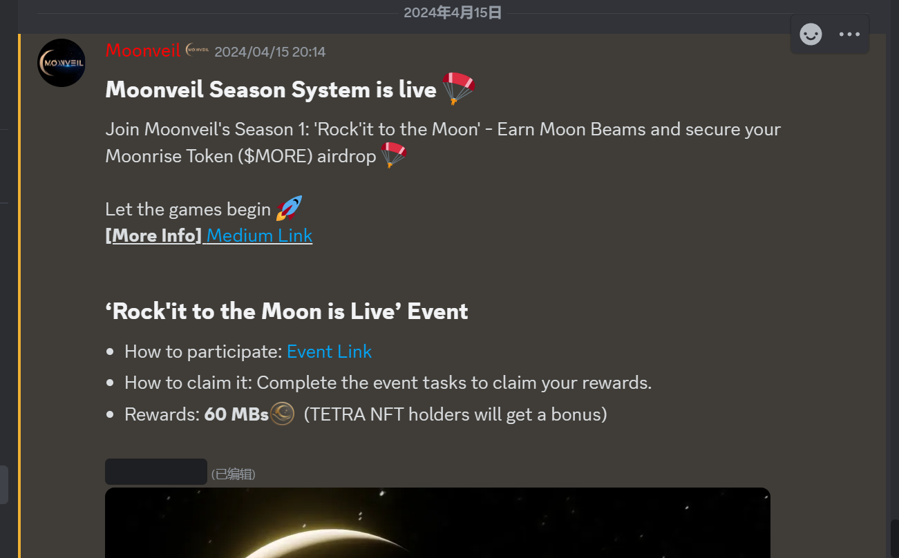
  - 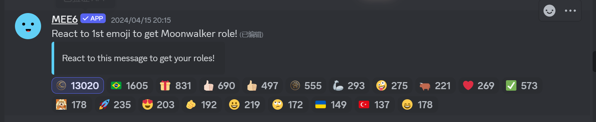
  - 在频道里查看自己的身份
  - 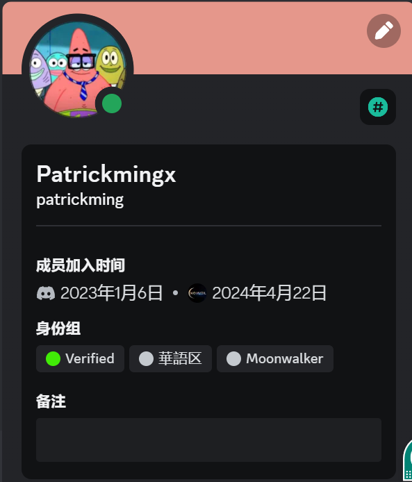
- 第三个是正常活动 做
- 第四个正常做 需要dc获得身份
  - 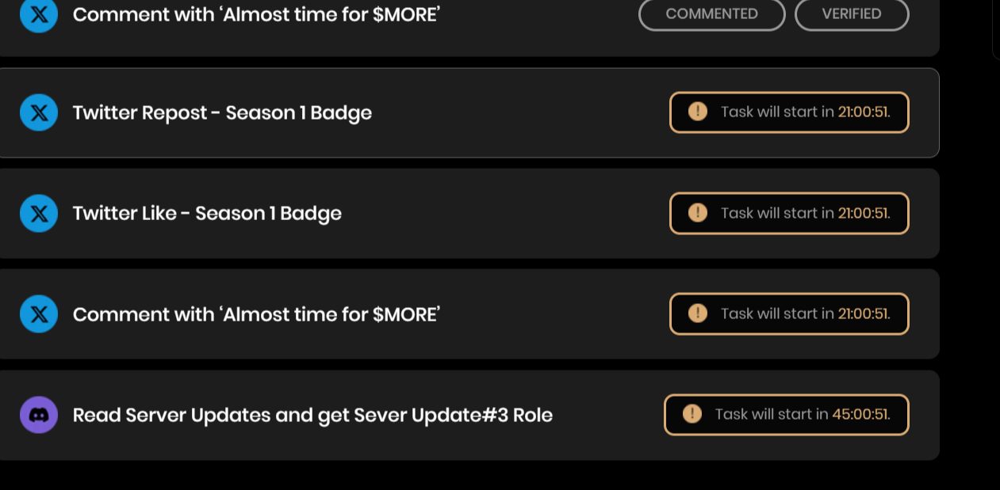
- 第五个也是要在dc上获得身份
  - 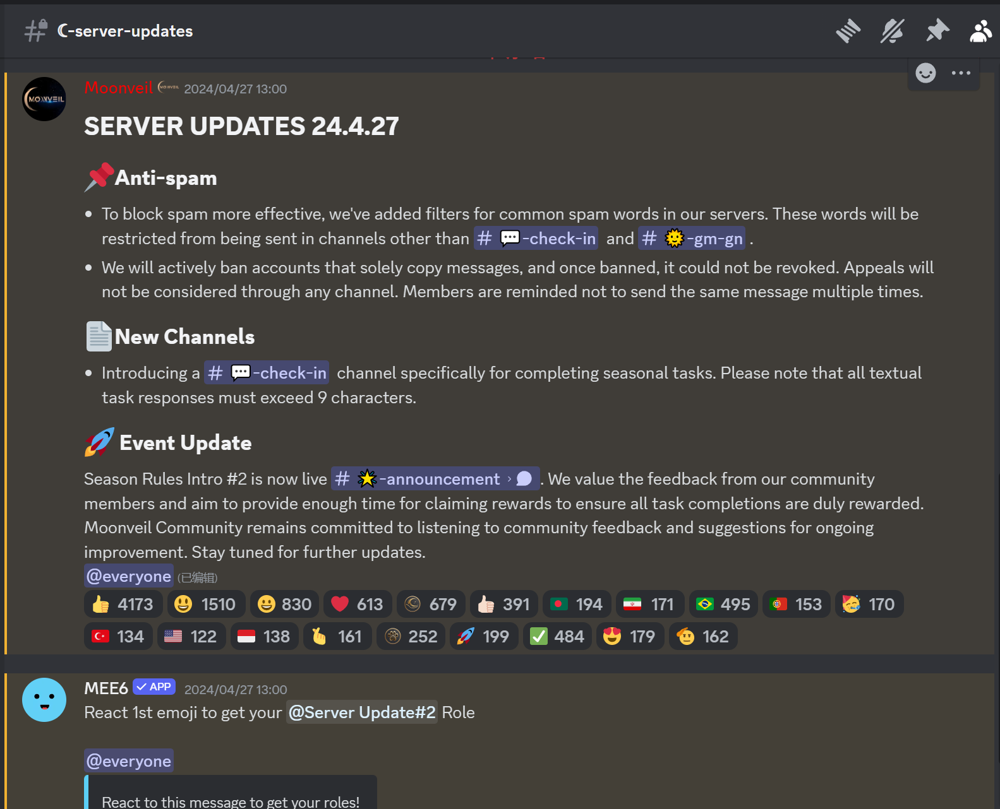

通行证部分

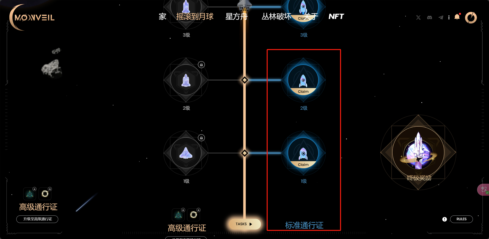

- 在做任务的时候 通行证也会升级 然后领取奖励