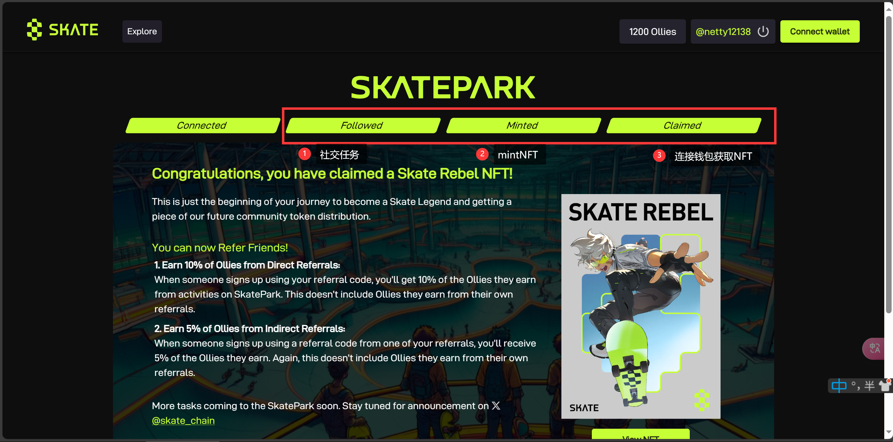

# SKATE PARK

自己没事整理一下空投资讯，主要是零撸的，供撸毛小白们使用，持续保持更新，也可提pr。

推特：[@RuoMinggX](https://x.com/RuoMinggX)

电报：[@RuoMinggX](https://t.me/RuoMinggX)

所有教程开源在 github: [web3 airdrop tutorial (github.com)](https://github.com/Patrickming/Airdrop-Tutorial/tree/main)

---

##  难度:简单 :star:

## 💲邀请链接：https://park.skatechain.org/?ref=mX31ipWYPr

1. 连接推特

2. 完成任务
- 这里需要连接钱包然后mintNFT，且获得大量积分
- 这个有些时候会出现卡顿 多试几次或者隔天再试即可

