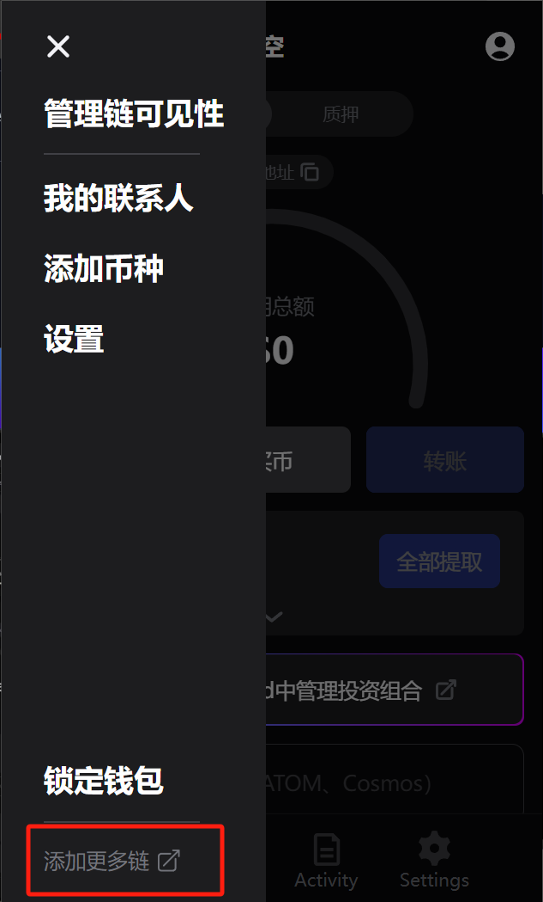
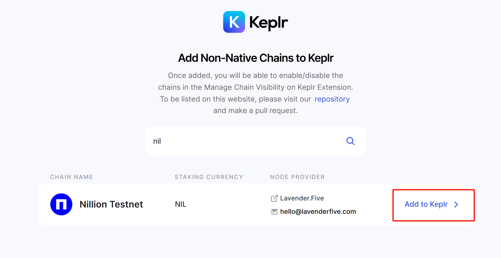
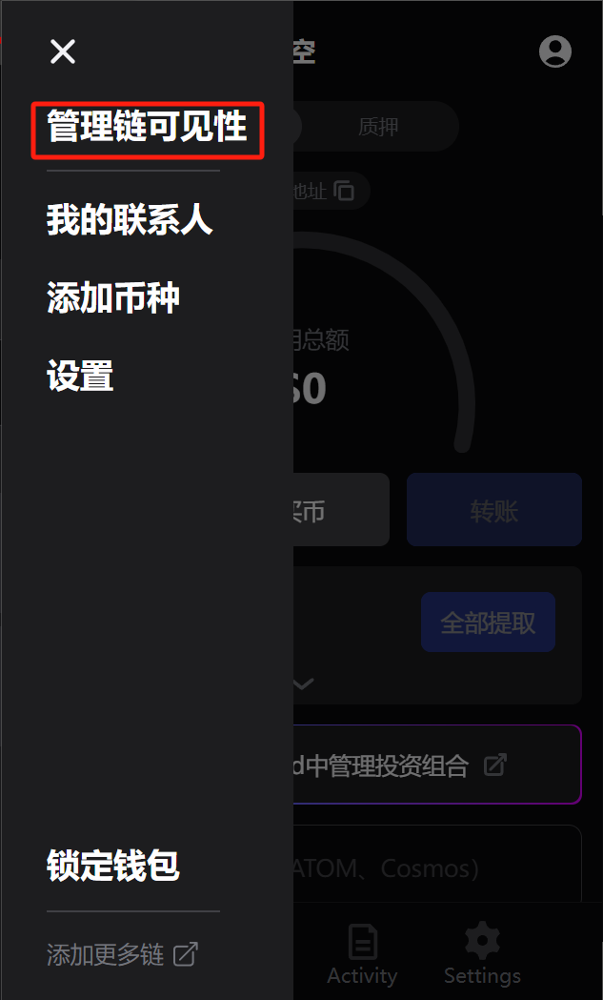
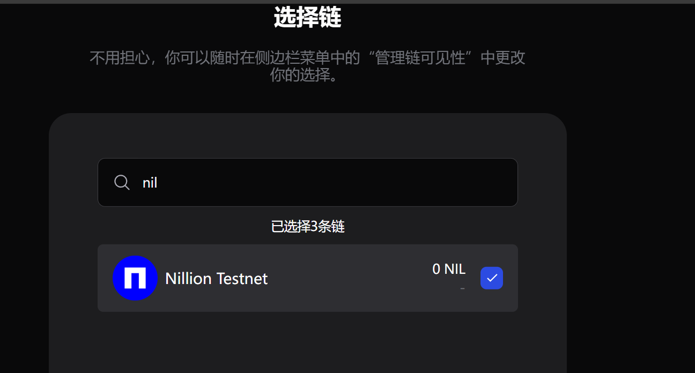
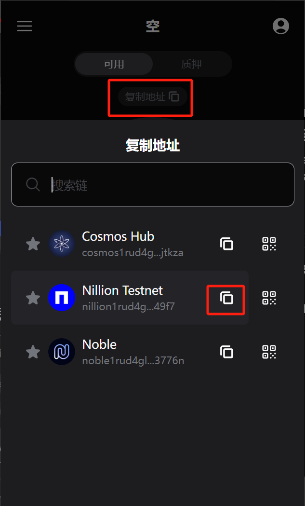
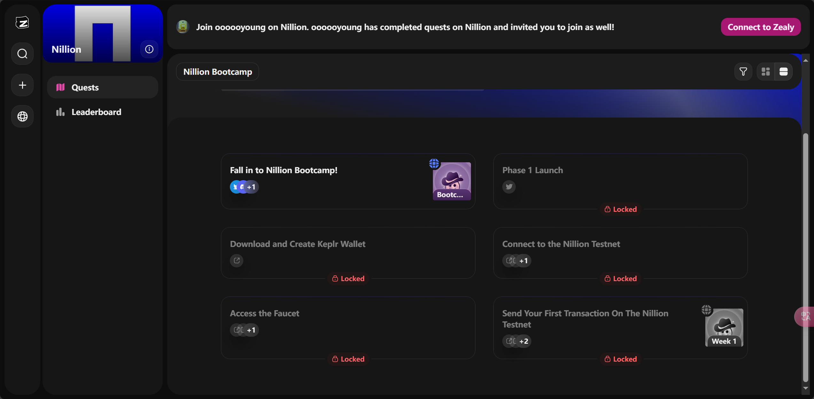

# nillion

自己没事整理一下空投资讯，主要是零撸的，供撸毛小白们使用，持续保持更新，也可提pr。

推特：[@RuoMinggX](https://x.com/RuoMinggX)

电报：[@RuoMinggX](https://t.me/RuoMinggX)

所有教程开源在 github: [web3 airdrop tutorial (github.com)](https://github.com/Patrickming/Airdrop-Tutorial/tree/main)

---

## 难度:普通 :star::star:

## 💲邀请链接：https://bubble.imaginaryones.com/?ref=ZKZSA8

- 目前第一阶段任务创世阶段，就只有转账交互任务和zealy，主要要完成zealy

1. 钱包准备

   1. 下载钱包[Download Keplr Wallet | Official Website](https://www.keplr.app/download)

   2. 添加网络 [Add Chains to Keplr](https://chains.keplr.app/)

      

      

   3. 把nil链设置为钱包内可见

      

      

   4. 复制地址

      

2. 水龙头领测试币 [nil Testnet Faucet (nillion.com)](https://faucet.testnet.nillion.com/)

   输入地址、完成人机测试

3. 发送 NIL 代币给其他地址（如果需要可以使用此地址：`nillion1rud4glal99g73wzs9c7hx4ga4lq9e750sj49f7`）

4. 交互后去完成相关交互的Zealy任务

   